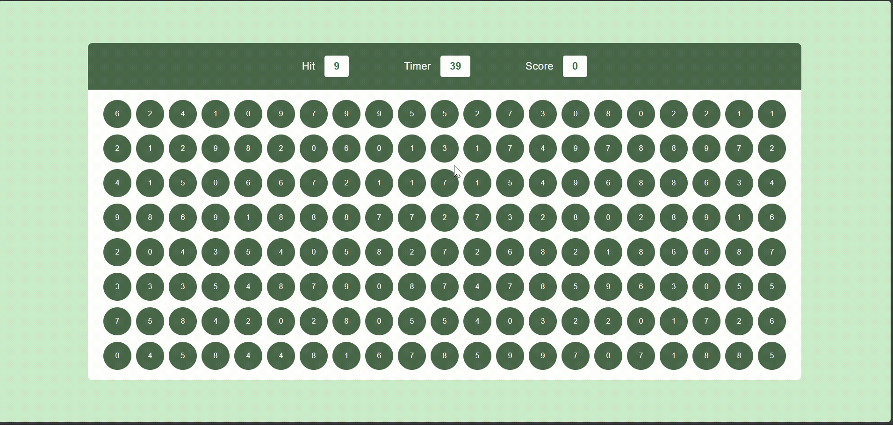

# 🎯 Bubble Burst Game – Event Bubbling in JavaScript

An interactive browser-based bubble game built using HTML, CSS, and JavaScript to demonstrate event bubbling and event delegation in a practical and engaging way. 
Players must click the correct bubble matching the target number within a 60-second time limit to score points.

---

## 📸 Demo

---

## 🚀 Features

 - 60-second countdown timer
 - Random target number generation
 - Dynamic bubble grid rendering
 - Score increases by +10 for every correct hit
 - Efficient event handling using event bubbling & delegation
 - Fully responsive and lightweight UI
 
 ---

 🧩 How the Game Works

 1. A random Hit Number is displayed.
 2. Multiple bubbles with random numbers appear on the screen.
 3. The player must click the bubble matching the hit number.
 4. Each correct click:
      - Increases score by 10 points
      - Generates a new hit number and refreshed bubbles
 5. The game ends automatically after 60 seconds.

---

🛠️ Tech Stack

- HTML – Structure
- CSS – Styling
- JavaScript – Game logic, DOM manipulation, and event handling

---

